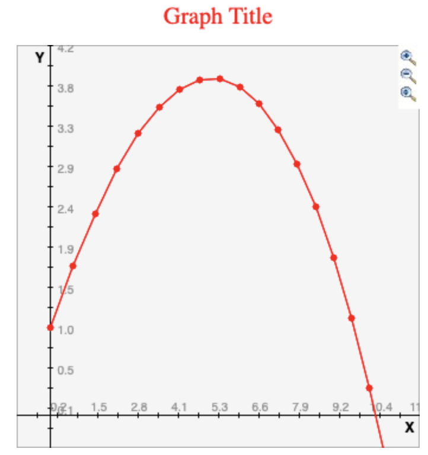

# CH 1

In chapter 1 we use our vector and points to create a projectile.  After
implementing, I made some slight modifications to the output so that I could
plot my points on a simple [web
application](http://www.shodor.org/interactivate/activities/SimplePlot/).

Here is my wonderful output

