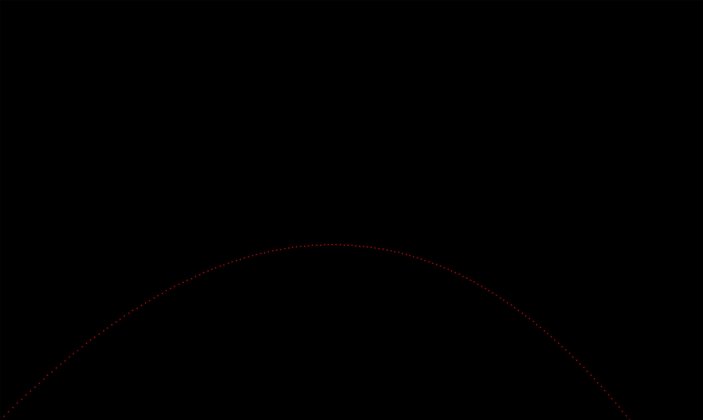

# CH 2

In chapter 1 we created a projectile.  In this section we created colors and
wrote a simple image writer.
We then used the writer to render the projectile's trajectory.

Here is my wonderful output

